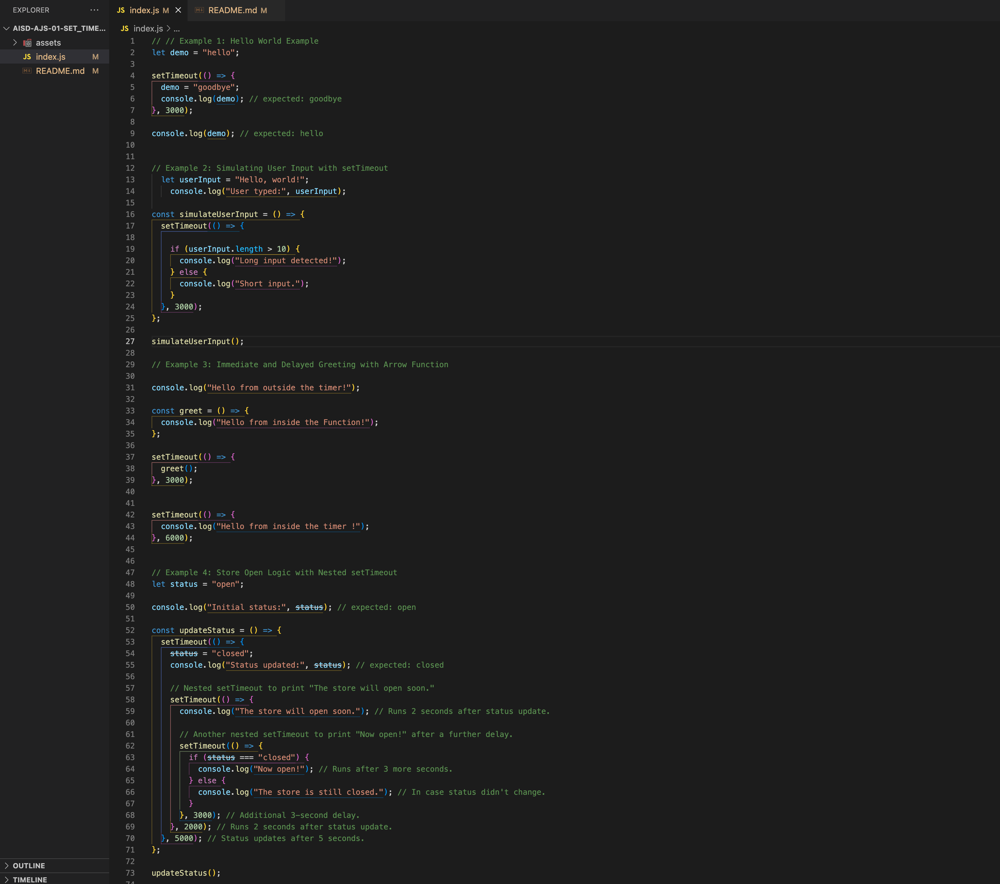

# `setTimeout()`: JavaScript's Built-in Timer Function



---

## Description 📄

The `setTimeout()` function is a **built-in JavaScript tool** used to execute code after a specific amount of time. It is often employed to **delay operations** or create **non-blocking behavior** in JavaScript programs. This is essential since JavaScript is **single-threaded** and needs to manage multiple tasks efficiently.

The primary purpose of `setTimeout()` is to allow the main thread to continue executing code while the specified function is deferred until the timer expires. This ensures that **time-consuming tasks** don’t block the UI or other important processes from running. After the timer finishes, the deferred function is placed into the **event queue** and waits for the call stack to be free before it runs.

`setTimeout()` is especially useful for:  
- **Simulating user interactions** (e.g., processing input with a delay).  
- **Running code after animations or events** without blocking the main program.  
- **Breaking down heavy computations** into smaller chunks to avoid freezing the interface.  
- **Polling or retrying operations** that depend on delayed resources (e.g., network requests).  
- **Managing sequential workflows**, like scheduling status changes or displaying messages in a specific order.  

The syntax for `setTimeout()` is as follows: 

```javascript
setTimeout(function, delayInMilliseconds);
```
Alternatively, using an arrow function:

```javascript
setTimeout(() => {
  console.log('This message appears after 3 seconds!');
}, 3000);
```

With `setTimeout()`, JavaScript continues executing other code while the timer runs. When the time elapses, the function provided to `setTimeout()` is executed. This helps create **smooth and responsive user interfaces**, especially when dealing with **asynchronous operations** or **time-based events**. The function improves performance by ensuring the **browser stays interactive**, even during **complex operations**.

##

## Expected Project Structure 🏗️
Your project should be structured as follows:

```plaintext
js-set-time-out/
├── script.js
└── README.md
```

##

# Instructions ✅

## 1. **Create the Project Folder and Files**
   - [ ] Create a project folder named `js-set-time-out` to store your project files.
   
   - [ ] Inside the nested-objects-practice folder, create a file named index.js. This will be your main JavaScript file where all your code will be written
   
### 2. **Use setTimeout() to Explore Asynchronous JavaScript**
In this step, you will create a basic JavaScript example using `setTimeout()` to understand how **asynchronous code** behaves. This function helps schedule tasks to run later, allowing other code to execute immediately without waiting. This ensures that time-consuming operations don’t block the rest of the program, improving performance and responsiveness.

- [ ] Add the following code to your `index.js` file:

```javascript
// Example: Hello World Example
let demo = "hello"; // Initialize variable

// Asynchronously change the value of 'demo' after 3 seconds
setTimeout(() => {
  demo = "goodbye";
  console.log(demo); // expected: goodbye
}, 3000);

console.log(demo); // expected: hello

- [ ] Run your code using Node.js in the terminal:

```bash
node index.js
```

### Expected Output:

```bash
hello
goodbye
```

### Explanation:

- **Initialized a Variable:** The `demo` variable is set to `"hello"`.  
- **Scheduled Code Execution:** The `setTimeout()` delays the change of `demo` to `"goodbye"` for 3 seconds.  
- **Asynchronous Behavior:** The program logs `"hello"` immediately because the `console.log(demo)` runs before the timer completes. After 3 seconds, the value of `demo` is updated to `"goodbye"` and logged to the console.  
- **JavaScript’s Non-Blocking Nature:** This demonstrates that JavaScript does not stop execution for `setTimeout()`—it continues running other code while the timer counts down.  

This example highlights how **asynchronous programming** ensures that heavy operations (like timers or network requests) don’t block the execution of other code, improving both **performance** and **user experience**.


### 3. **Simulate User Input with setTimeout()**
In this step, you will create a JavaScript example to **simulate user input** using `setTimeout()`. This example will delay the processing of the input to mimic real-world scenarios, such as waiting for the user to finish typing before validating the input. You’ll also explore how **conditional logic** can evaluate the input length after the delay.

- [ ] **Comment out the code you have so far** from the first example in your `index.js` file.

- [ ] Now add the following code to your `index.js` file:

```javascript
// Example: Simulating User Input with setTimeout
let userInput = "Hello, world!"; // Initial input value
console.log("User typed:", userInput); // Logs the input immediately

const simulateUserInput = () => {
  setTimeout(() => {
    // Check if the input length is greater than 10 characters
    if (userInput.length > 10) {
      console.log("Long input detected!");
    } else {
      console.log("Short input.");
    }
  }, 3000); // Delay of 3 seconds
};

// Call the function to simulate delayed input processing
simulateUserInput();
```

### 3. **Simulate User Input with setTimeout()**
In this step, you will create a JavaScript example to **simulate user input** using `setTimeout()`. This example will delay the processing of the input to mimic real-world scenarios, such as waiting for the user to finish typing before validating the input. You’ll also explore how **conditional logic** can evaluate the input length after the delay.

- [ ] **Comment out the code you have so far** from your first example in your `index.js` file.

- [ ] Add the following code to your `index.js` file:

```javascript
// Example: Simulating User Input with setTimeout
let userInput = "Hello, world!"; // Initial input value
console.log("User typed:", userInput); // Logs the input immediately

const simulateUserInput = () => {
  setTimeout(() => {
    // Check if the input length is greater than 10 characters
    if (userInput.length > 10) {
      console.log("Long input detected!");
    } else {
      console.log("Short input.");
    }
  }, 3000); // Delay of 3 seconds
};

// Call the function to simulate delayed input processing
simulateUserInput();
```

- [ ] Run your code using Node.js in the terminal:

```bash
node index.js
```

### Expected Output:

```bash
User typed: Hello, world!
Long input detected!
```

- [ ] Now try changing the value of userInput to a shorter string (e.g., "Hi"), and run the code again. What happens ? 

### Explanation:

- **Initialized a Variable:** The `userInput` variable is set to `"Hello, world!"`.  
- **Logged the Input Immediately:** The `console.log()` logs the user’s input before the delay.  
- **Scheduled Code Execution:** The `setTimeout()` waits for 3 seconds before checking the input length.  
- **Conditional Check:** After the delay, the function evaluates whether the input length is greater than 10 characters and logs the appropriate message.  
- **Asynchronous Behavior:** JavaScript logs the input immediately, then processes the conditional logic only after the 3-second timer completes.  

When you **change the input to a shorter string (e.g., `"Hi"`)**, the conditional check will result in `"Short input."` being logged instead. This shows how `setTimeout()` allows you to introduce **dynamic behavior** based on the data provided by the user. By experimenting with different input lengths, you can see how the program’s output adapts in real time, demonstrating the **flexibility and responsiveness** of asynchronous JavaScript.

### 4. **Use setTimeout() with Arrow Functions for Immediate and Delayed Greetings**

In this step, you will explore how **arrow functions** work with `setTimeout()` to execute both immediate and delayed actions. This example demonstrates the flexibility of **arrow functions**, allowing you to schedule tasks for future execution while still executing code immediately.

- [ ] **Comment out the previous code** in your `index.js` again file to avoid conflicts.

- [ ] Add the following code to your `index.js` file:

```javascript
// Example: Immediate and Delayed Greeting with Arrow Function

console.log("Hello from outside the timer!"); // Immediate log

const greet = () => {
  console.log("Hello from inside the Function!"); // Logs after 3 seconds
};

setTimeout(() => {
  greet(); // Executes the greet function after 3 seconds
}, 3000);

setTimeout(() => {
  console.log("Hello from inside the timer!"); // Logs after 6 seconds
}, 6000);

- [ ] Run your code using Node.js in the terminal:

```bash
node index.js
```

### Expected Output:

```bash
Hello from outside the timer!
Hello from inside the Function!  // after 3 seconds
Hello from inside the timer!     // after 6 seconds
```

### Explanation:

- **Immediate Log:** The `console.log()` prints `"Hello from outside the timer!"` as soon as the program runs. This demonstrates that **synchronous code** runs first before any timers are triggered.

- **First Delayed Execution:** After 3 seconds, the `greet()` function is executed via `setTimeout()`. This function logs `"Hello from inside the Function!"`. The use of **arrow functions** makes the code concise and easier to read. Even though the `greet()` function is scheduled to run after 3 seconds, **JavaScript does not pause**—it keeps running other code until the time is up.

- **Second Delayed Log:** A separate `setTimeout()` logs `"Hello from inside the timer!"` after 6 seconds. This demonstrates that **multiple timers can run independently**, and each timer will execute after the specified delay, regardless of what other code is doing.

- **Asynchronous Flow:** This example highlights the **non-blocking behavior** of JavaScript. While two `setTimeout()` functions are running in the background, the main program continues executing other code immediately. The timers are placed into the **event queue** and executed once the specified time elapses.

- **Independent Timers:** The `setTimeout()` for the `greet()` function and the second timer are **independent of each other**. Even though they are scheduled to run at different times, both will execute exactly when their timers finish, without interfering with each other.

- **Real-World Relevance:** This pattern is useful in many real-world scenarios. For example, you could use `setTimeout()` to **display loading messages** or **update a user interface** after a certain event occurs. Scheduling multiple timers allows you to **manage time-sensitive tasks efficiently** in a non-blocking way.

This example shows how **arrow functions and multiple timers** allow for precise control over when tasks are executed. By using `setTimeout()`, developers can ensure **smooth execution and responsive behavior**, even when several operations are happening at different times.


### 5. **Implement Store Open Logic with Nested setTimeout()**
In this step, you will create a more complex example using **nested `setTimeout()` calls** to simulate a store's status changes. This example demonstrates how **multiple delays** can be used to execute tasks in a specific sequence. You’ll see how **nested timeouts** allow you to control when different operations occur, one after the other.

- [ ] **Comment out the previous code** in your `index.js` file again to avoid conflicts.

- [ ] Add the following code to your `index.js` file:

```javascript
// Example: Store Open Logic with Nested setTimeout
let store_status = "open";

console.log("Initial status:", store_status); // expected: open

const updateStatus = () => {
  setTimeout(() => {
    store_status = "closed";
    console.log("Status updated:", store_status); // expected: closed

    // Nested setTimeout to print "The store will open soon."
    setTimeout(() => {
      console.log("The store will open soon."); // Runs 2 seconds after status update.

      // Another nested setTimeout to print "Now open!" after a further delay.
      setTimeout(() => {
        if (store_status === "closed") {
          console.log("Now open!"); // Runs after 3 more seconds.
        } else {
          console.log("The store is still closed."); // In case status didn't change.
        }
      }, 3000); // Additional 3-second delay.
    }, 2000); // Runs 2 seconds after status update.
  }, 5000); // Status updates after 5 seconds.
};

// Call the function to start the store status updates
updateStatus();

- [ ] Run your code using Node.js in the terminal:

```bash
node index.js
```

### Expected Output:

```bash
Initial status: open
Status updated: closed        // after 5 seconds
The store will open soon.      // after 7 seconds (5 + 2)
Now open!                      // after 10 seconds (5 + 2 + 3)
```


### Explanation:

- **Initial Status:** The `store_status` variable is initialized to `"open"` and logged immediately when the program starts. This demonstrates that **synchronous code** is executed first before any timers take effect.

- **First Timeout:** After 5 seconds, the `store_status` is changed to `"closed"`, and the updated status is logged. At this point, **JavaScript schedules the next operation** without pausing or blocking the execution of other tasks.

- **Second Nested Timeout:** 2 seconds after the status change (7 seconds total), the program logs `"The store will open soon."`. This message is scheduled using **another `setTimeout()` inside the first one**, showcasing how **nested timeouts** work to ensure tasks occur sequentially.

- **Third Nested Timeout:** After an additional 3 seconds (10 seconds total), the program checks whether the `store_status` is still `"closed"`.  
  - If it is, the program logs `"Now open!"`, indicating the store has reopened.  
  - If the status has changed (though it won’t in this example), the program would log `"The store is still closed."`.  

This example demonstrates how **timed operations** can be controlled using **nested `setTimeout()` calls**, ensuring tasks run in the correct sequence. The non-blocking behavior of JavaScript ensures that **while these timers are running, other operations are not halted**, improving both **performance** and **user experience**.

## Conclusion 📄


In this assignment, you gained hands-on experience working with the `setTimeout()` function in JavaScript, a key tool for managing **asynchronous operations**. By exploring how to delay code execution, simulate input, and manage multiple timers through nested functions, you developed a deeper understanding of how **JavaScript’s non-blocking behavior** enhances performance and responsiveness.

**Key Takeaways:**

- **Understanding Asynchronous Execution**: You practiced scheduling tasks with `setTimeout()` and observed how JavaScript continues executing other code while waiting for the timer to expire. This is essential for building **non-blocking, responsive applications**.

- **Using Arrow Functions for Simplicity**: You learned how arrow functions can make the code more concise and readable when working with `setTimeout()`. This demonstrates how modern JavaScript syntax enhances productivity.

- **Simulating User Input with Timers**: You saw how `setTimeout()` can be used to **simulate delayed user interactions** and handle conditional logic based on input values. This is a common technique in real-world applications, such as forms and user input validation.

- **Managing Timed Operations with Nested Timers**: By using **nested `setTimeout()` calls**, you explored how to schedule multiple tasks in sequence. This skill is crucial for managing **state transitions** and **time-sensitive workflows**, such as notifications or status updates.

- **Building Scalable Applications**: This assignment emphasized the importance of **asynchronous programming** for maintaining performance and responsiveness. Managing delays efficiently ensures your code can handle complex operations without blocking the main thread.

By mastering these techniques, you are better prepared to build **dynamic and scalable JavaScript applications** that require precise control over timing and state. This knowledge will help you develop more **interactive user experiences** and effectively manage **time-sensitive tasks** in real-world scenarios.

### Solution codebase 👀
🛑 **Only use this as a reference** 🛑

💾 **Not something to copy and paste** 💾

**Note:**  This lab references a solution file located [here](https://github.com/HackerUSA-CE/aisd-ajs-01-set_time_out/tree/solution) (link not shown).


---
© All rights reserved to ThriveDX